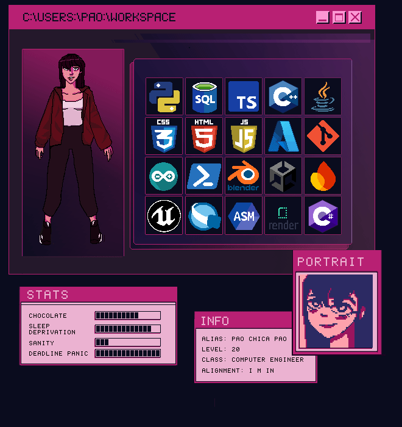

    

 

 

 

**Who Am I?**

 
 

I’m a Computer Engineering student with a strong interest in Digital Design, Computer Architecture, Semiconductors, and Low-Level Systems. 

You’ll very often find me at Hackatons, as apparently, I love torturing my poor neurons for the sake of the game. Jokes aside, I have a constant urge to create, so therefore I love to participate in projects that test my abilities and push me to learn and adapt.

I also think of myself as multidisciplinary. Rather than staying in a single field, I enjoy combining concepts from different areas into a single project. After all, a system is made from interconnected pieces that, all put together, make up for something greater.

 
 

**PAO'S ROOM**

 

  
  

  

