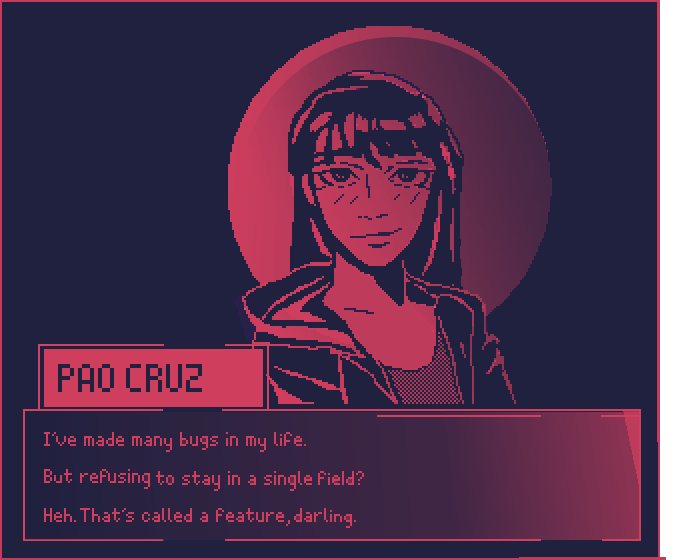

<!DOCTYPE html>
<html lang = "en">
<head>
</head>
<body>
    

    

      

    
    
    

    
</body>

<!--
**Mr-Crux-Ansata/Mr-Crux-Ansata** is a ✨ _special_ ✨ repository because its `README.md` (this file) appears on your GitHub profile.

Here are some ideas to get you started:

- 🔭 I’m currently working on ...
- 🌱 I’m currently learning ...
- 👯 I’m looking to collaborate on ...
- 🤔 I’m looking for help with ...
- 💬 Ask me about ...
- 📫 How to reach me: ...
- 😄 Pronouns: ...
- ⚡ Fun fact: ...
-->
